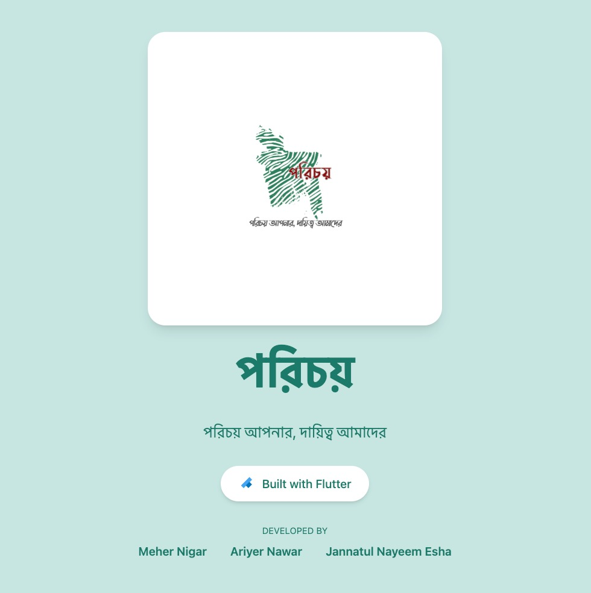
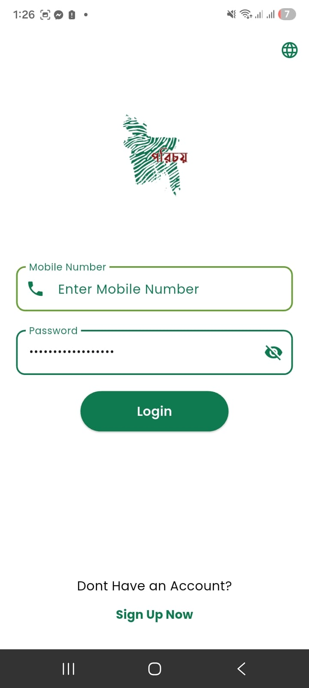
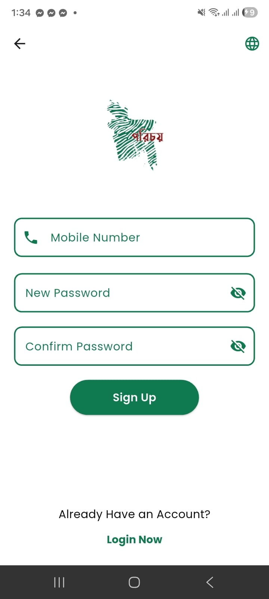
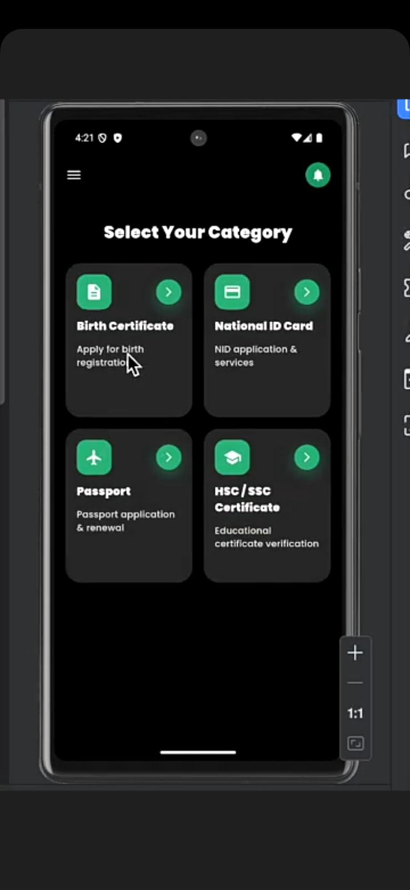
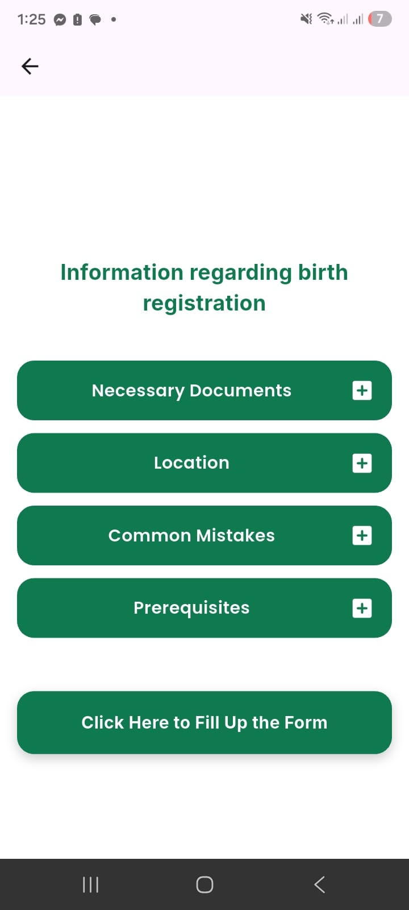
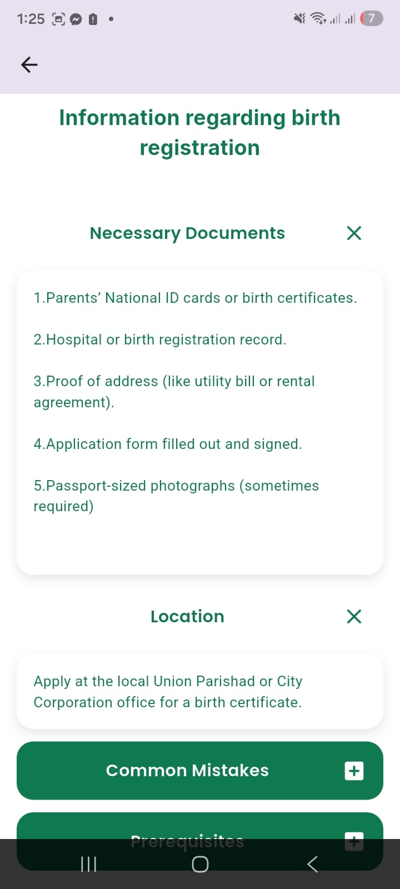
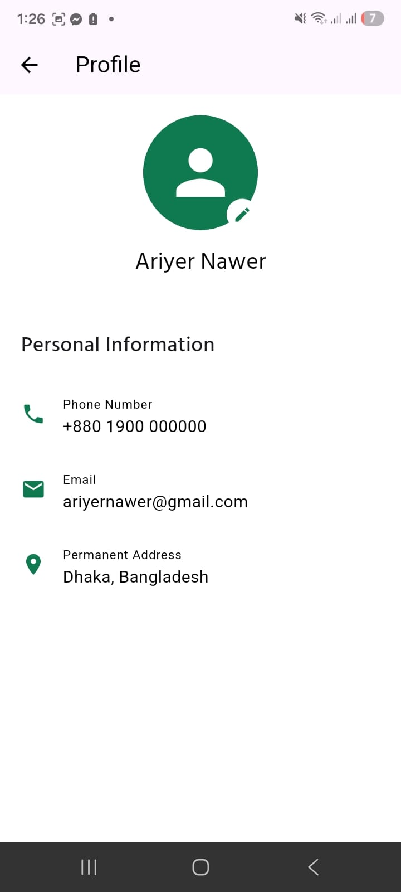
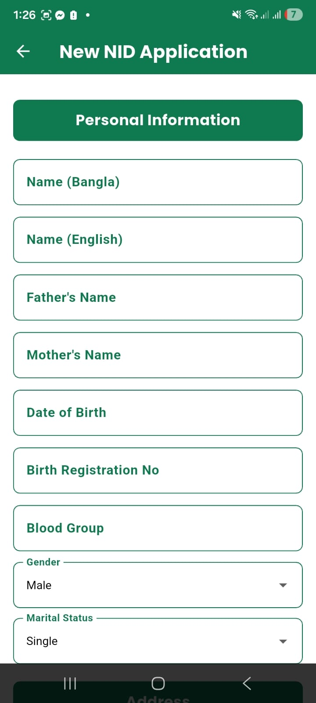

# porichoy

# Porichoy

A modern Flutter application that simplifies government services for citizens by providing step-by-step guidance for official documents, application procedures and public services in Bangladesh.

  

---

## 📌 Overview

Many people in Bangladesh face difficulties when applying for essential government services such as a National ID (NID), Passport, Birth Certificate, SSC/HSC Certificate.

They often don't know:

- Which office they need to visit
- Which authority they should contact
- What documents are required
- How much the application will cost
- How long the process will take
- What steps they need to follow

As a result, people spend unnecessary time searching different websites, asking others for information, or visiting government offices without proper preparation.

**Porichoy** is designed to solve this problem by providing all the essential information in one place through a simple and user-friendly interface. Users can easily find the required documents, application procedures, office information, fees, processing time, and important guidelines for various government services.

#  Features

## 🏛 Government Service Information

Access complete information for various government services, including:

- National ID (NID)
- Passport
- Birth Registration
- SSC/HSC Certificate.

Each service provides:

- Required documents
- Eligibility requirements
- Step-by-step application process
- Government fees
- Processing time
- Office location
- Contact information
- Important instructions before visiting

---

##  Smart Form Filling

Users can complete government-related forms directly within the app.

Features include:

- Easy-to-fill digital forms
- Auto-save progress while filling
- Resume incomplete forms anytime

## 💾 Auto Save Drafts

Never lose your progress.

If a user closes the app or leaves before completing a form, all entered information is automatically saved locally. Users can continue exactly where they left off.

## ❓ FAQ & Help Center

A dedicated help page containing answers to frequently asked questions, such as:

- Which office should I visit?
- What documents are required?
- What should I bring with me?
- Who should I contact?
- How much will it cost?
- How long does the process take?

This helps users understand the process before visiting any government office.

---

## 📢 Complaint & Feedback System

Users can report issues related to government services, including:

- Bribery or illegal money requests
- Staff misconduct
- Service-related problems
- Other complaints and suggestions

Complaints can be submitted directly through the app for further review.

---

## 🌐 Bilingual Support

- English
- বাংলা

Users can switch between languages anytime for a better experience.

---

## Light & Dark Mode

Personalize the app with:

- Light Mode
- Dark Mode

The selected theme is remembered for future sessions.

---

## 🔐 User Authentication

Secure login system using Firebase Authentication.

- Sign Up
- Login
- Logout
- Secure access to saved forms and preferences

---

---

## 📱 Modern User Experience

- Material 3 Design
- Clean and intuitive interface
- Responsive layout
- Smooth navigation
- User-friendly experience

---

# 📷 Screenshots

### Authentication

  
   

## **Homepage**

  
  

## **Necessary Information**

  
    
  

### Profile

  
  

## **Form Fill-Up**

  
    
  

---

# 🛠 Tech Stack

## Frontend

- Flutter
- Dart
- Firebase Authentication
- Cloud Firestore

## Local Storage

- SharedPreferences

## UI

- Material 3
- Google Fonts

---

# 🚀 Future Plans

- AI-powered document assistant
- Smart eligibility checker
- OCR document scanner
- Appointment reminders
- Office navigation
- Offline mode
- Chat support
- Push notifications
- PDF document checklist

---

# 👨‍💻 Developers

### Meher Nigar
GitHub:
https://github.com/mehernigar17
LinkedIn:
www.linkedin.com/in/meher-nigar-315135388
### Ariyer Nawar Purnota

---

